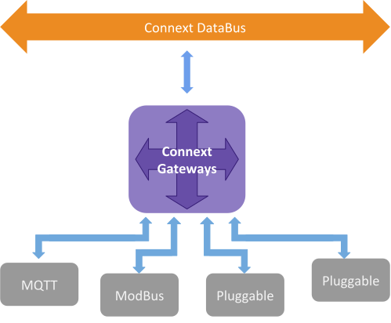
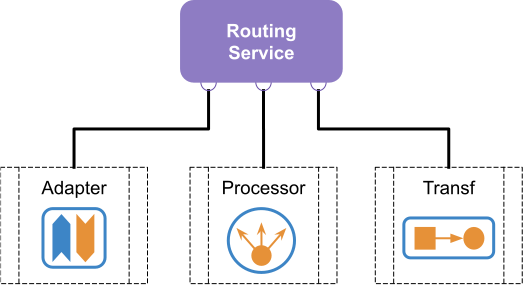
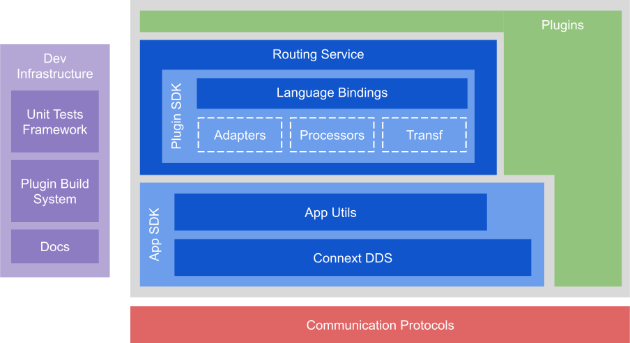

.. include:: vars.rst

.. _section-introduction:

Introduction
============

|RTI_GATEWAY_PLAIN| Architecture
--------------------------------

The |RTI_GATEWAY_TM| is a software component that allows integrating
different types of connectivity protocols with DDS. Integration in this
context means that data flows from different protocols are adapted to
interface with DDS, establishing communication from and to DDS.

   |RTI_GATEWAY| *Architecture*

Figure above shows the applicability of the |RTI_GATEWAY|. Note
that a set of different protocols have been selected for the sake of the
example, but the key capability of the |RTI_GATEWAY| is that it
can *adapt* **any** connectivity protocol.

Routing Service Plugins Architecture
------------------------------------

The Adapter SDK included with |RS| (also known as |RS_SDK|) can already be used
to address the main integration use case targeted by |RTI_GATEWAY|. In
fact, |RS| adapters have become the de-facto standard solution for integrating
DDS systems with other technologies.

Nevertheless, the |RS_SDK| is very generic and possibly daunting for
inexperienced users, who are faced with a powerful data integration framework,
but little guidance on how to best put it to use. The standard distribution
also does not include any plugin that users may use either "off-the-shelf"
in their systems, or as a reference for creating their own plugins.

For this reason, |RTI_GATEWAY| includes several examples of
ready-to-use protocol integration plugins for DDS. It also exposes a refined
plugin development framework, which builds on the |RS_SDK| but simplifies
development and management of this class of plugins.

The |RS_SDK| product is pictured in figure the below. Essentially, the SDK is
composed of the following components:

- |RS|: binary component that provides an engine to
  process data through a set of plugins.

- *Adapter*: pluggable component in charge of providing access to a
  specific data domain.

- *Transformation*: single-input, single-output, pluggable component that
  performs custom manipulation of data samples.

- *Processor*: multi-input, multi-output, pluggable component that
  controls a user-configurable set of data flows.

   |RS| *Plugins Architecture*

|RTI_GATEWAY_PLAIN| Framework
-----------------------------

|RTI_GATEWAY| provides an open framework for users to easily extend
the included set of plugins with support for additional communication protocols.

The |RS_SDK| has been enhanced with a new set of components that better support
the development of user-defined plugins. The resulting framework and its
different modules are shown in figure below:

   |RTI_GATEWAY| *Framework*

- **Routing Service**: The Routing Service engine with the pluggable SDK.

- **Plugins**: |RS| plugins that provide integration with external,
  non-DDS communication protocols. Includes both plugins shipped with
  |RTI_GATEWAY|, and those created by users.

- **App SDK**: Libraries to aid and support the development of user plugins.
  Includes the RTI Connext DDS SDK, and a new AppUtils helper module. These
  libraries provide several useful reusable components, such as the
  `DynamicData <https://community.rti.com/static/documentation/connext-dds/6.0.1/doc/api/connext_dds/api_c/group__DDSDynamicDataModule.html>`_
  API for data manipulation, `AsyncWaitSet <https://community.rti.com/static/documentation/connext-dds/6.0.1/doc/api/connext_dds/api_c/group__DDSAsyncWaitSetModule.html>`_
  for multi-threaded event processing, and a JSON parser.

- **Development Infrastructure**: This module contains blocks to
  facilitate the development process of the user plugins. It mainly
  consists of a build system, a unit test framework, and
  documentation generation infrastructure.

|RTI_GATEWAY_PLAIN| Plugins
---------------------------

|RTI_GATEWAY| ships with a set of ready-to-use plugins. These include
both some examples of protocol integration, and some useful utilities for
common data processing needs. Please refer to each plugin's user manual for more
information on its use and configuration:

  * Adapters

    * `Modbus® <adapters/modbus/index.html>`__ : Integration plugin for the MODBUS protocol.
    * `MQTT <adapters/mqtt/index.html>`__ : Integration plugin for the MQTT protocol.
    * `Kafka® <adapters/kafka/index.html>`__ : Integration plugin for the Kafka protocol.

  * Processors

    * `Forwarder <processors/fwd/index.html>`__ : Custom forwarding of data within a route.

  * Transformations

    * `Field <transformations/tsfm_field/index.html>`__ : Extract an attribute from input samples and convert its value to a string.
    * `JSON <transformations/tsfm_json/index.html>`__ : Convert DDS samples to JSON format.
    * `Seq2Array <transformations/tsfm_seq2array/index.html>`__ : Transform sequences to arrays for DDS samples.
