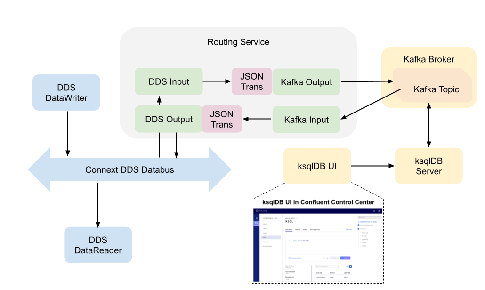

# Kafka Shapes - An example integration of DDS and Kafka
This directory contains an example that demonstrates how DDS and Kafka can be integrated to allow DDS applications to access Kafka data and vice versa.

The integration is achieved by deploying RTI Routing Service with the Kafka adapter plugin. The plugin establishes client connetions to Kafka brokers, and to access Kafka data which encapsulates Kafka payload in JSON. 

## Data Types
The example uses the following `ShapeType` as a data type:
```idl
struct ShapeType
{
    string<128> color; //@key
    long x;
    long y;
    long shapesize;
};
```

Kafka applications use JSON to encode data, fololowing the defined data type. An example encoded data looks like:
```json
{
    "color": "BLUE",
    "x": 1,
    "y": 2,
    "shapesize": 10
}
```

The following figure presents the overall architecture of the example scenario. The example scenario enables real-time stream processing capabilities on DDS with ksqlDB (Kafka-based database for stream processing). 



- **DDS DataWriter** publishes DDS data over Connext DDS Databus.
- **DDS DataReader** subscribes to DDS data over Connext DDS Databus. 
- **DDS Input** subscribers to DDS data over Connext DDS Databus and passes the data to Kafka Output.
- **DDS Output** transforms JSON data to DDS from Kafka input and then publishes the data over Connext DDS databus 
- **Kafka Input** subscribes to Kafka data from a Kafka broker and passes the data to DDS Output. 
- **Kafka Output** receives DDS data from DDS Input and converts the data from DDS to JSON data. Then, it will publish the data to a Kafka Broker. 
- **Kafka Broker** exchanges Kafka data between producers (e.g., Kafka Output) and consumers (e.g., Kafka Input). 
- **ksqlDB engine** executes SQL statements and queries. Users can define stream processing logic by writing SQL statements, and ksqlDB builds and runs the application. Under the hood, ksqlDB parses SQL statements and builds corresponding Kafka Streams topologies.
- **ksqlDB UI** allows users to write SQL statements with a web-based graphical user interface. 

## Run Kafka infrastructure components
To run this example, the following Kafka components are required to run. 
- ZooKeeper
- Kafka Broker
- Confluent Control Center
- ksqlDB Server

You can use the Docker Compose file provided by Confluent to run them. Please see [this link](https://github.com/confluentinc/cp-all-in-one/tree/6.2.0-post/cp-all-in-one).  

## Running RTI Routing Service with the Kafka adapter plugin
1. Run Kafka infrastructure components:
    Please install [Docker Engine](https://docs.docker.com/engine/install) and [Docker Compose](https://docs.docker.com/compose/install) to run the containers for Kafka. 

    Download the Docker Compose file provided by Confluent.
    ```sh
    $ git clone https://github.com/confluentinc/cp-all-in-one.git
    ```

    Start up the Docker containers for Kafka.

    ```sh
    $ cd cp-all-in-one/cp-all-in-one
    $ docker-compose up -d
    ```
2. After the Kafka services are running, you can acess the Web-based management UI called `Confluent Control Center` at `localhost:9021`.

3. Start an *RTI Shapes Demo* instance:

    ```sh
    $NDDSHOME/bin/rtishapesdemo
    ```

4. Publish a `Square` topic.

    You can create a shapes publisher by clicking in the following
    menu items in the *RTI Shapes Demo* application:

    - "Publish/Square..." and click 'OK' to use the default parameters.

5. In a separate terminal, start an *RTI Routing Service* instance with the example XML configuration:

    ```sh
    $NDDSHOME/bin/rtiroutingservice -cfgFile  kafka_adapter_simple.xml -cfgName dds_kafka_bridge
    ```

6. In Confluent Control Center(localhost:9021), you can see the `Square` topic under the `Topics` tab. After clicking the `Square` topic, You can see the `Square` topic data coming from the RTI Gateway.

