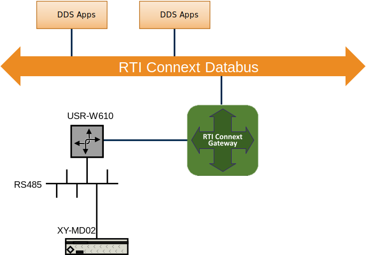

# Example Modbus Gateway and Serial Device

## Description of the Example

This example shows how to connect to the serial device [XY-MD02](http://www.sah.rs/media/sah/techdocs/xy-md02-manual.pdf)
through a Modbus gateway [USR-W610](https://www.pusr.com/products/rs232/rs485-to-wifi-converters-usr-w610.html)
and RS485.
The configuration used for this example contains the following fields:

* Modbus Input - modbus_serial_device.idl
  * serial_id
  * temperature_celsius
  * humidity
  * device_address
  * baud_rate
  * temperature_correction
  * humidity_correction

You can find the IDL file used for this example under:

* *example/modbus/modbus_gateway_serial/idl*

This example will read the data specified above from the XY-MD02 device every
second. The configuration of the *modbus_server_ip* and *modbus_server_port*
should use the gateway USR-W610 information. The *modbus_slave_device_id* should
be the slave ID of the XY-MD02 device in the RS485 serial network.

> **NOTE**: you need to modify the *modbus_server_ip* and *modbus_server_port*
> to point to the correct device IP.



## Running the Example

In three separate command prompt windows for Routing Service, DDS publisher
and DDS subscriber. Run the following commands from the example directory (this
is necessary to ensure the application loads the QoS defined in
*USER_QOS_PROFILES.xml*, which requires *USER_QOS_PROFILES.xml* to be present in
the working directory):

```sh
rtiroutingservice -cfgFile RSConfigAdapter.xml -cfgName RSModbusAdapterSerialExample
```

```sh
./modbus_serial_device
```

> **NOTE**: the `libmodbus` and `rtimodbusadapter` libraries should be reachable
> by the OS. Add the corresponding folders to your `LD_LIBRARY_PATH`, `PATH` or
> `RTI_LD_LIBRARY_PATH` environment variable (depending on your OS). If you
> follow these instructions, the folder is:
> `<path to rticonnextdds-gateway>/install/lib`.

After running the Routing Service and modbus_serial_device, you will read
messages from the modbus device:

> Received data
> &nbsp; &nbsp; serial_id: 1
> &nbsp; &nbsp; temperature_celsius: 27.3000011
> &nbsp; &nbsp; humidity: 95.8000031
> &nbsp; &nbsp; device_address: 1
> &nbsp; &nbsp; baud_rate: 9600
> &nbsp; &nbsp; temperature_correction: 0
> &nbsp; &nbsp; humidity_correction: 0

After that, run the DDS Writer

```sh
./temperature_correction
```

You will see how this modifies the value of *temperature_correction*.

The *temperature_correction* will be updated in the range [-11,11].
The value -11 and 11 will be out of the ranged specified in the JSON
configuration. Therefore the window that runs the Routing Service will show the
following message indicating the error:

> Error: value <-11> of element <temperature_correction> out of range [-10,10].
> Error: value <11> of element <temperature_correction> out of range [-10,10].
