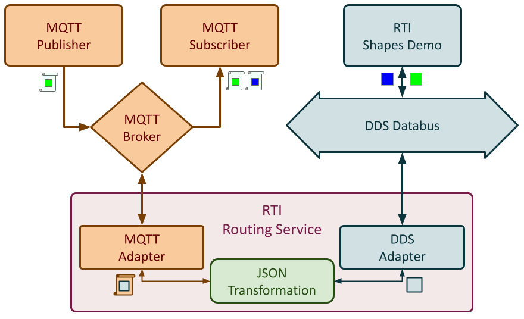

# Shapes Demo & MQTT - A basic example integration of DDS and MQTT

This example demonstrates how to bridge DDS and MQTT with the help of
Shapes Demo.

The integration is achieved by deploying RTI Routing Service with the MQTT
adapter plugin, and the JSON transformation plugin.

The MQTT plugin establishes a client connection to the MQTT broker, while
the JSON transformation is used to manipulate the JSON payload contained in
each MQTT message.

The example uses the basic `ShapeType` defined by Shapes Demo:

```idl
struct ShapeType
{
    string<128> color; //@key
    long x;
    long y;
    long shapesize;
};
```

The JSON format used to encode data in MQTT follows the default mapping
for the IDL type as specified by the [DDS-JSON specification](https://www.omg.org/spec/DDS-JSON/),
e.g.:

```json
{
    "color": "BLUE",
    "x": 1,
    "y": 2,
    "shapesize": 10
}
```

The following figure presents the overall architecture of the example scenario:



- **MQTT Publisher**: publishes a random green square every second.
  Shapes are encoded into JSON strings, and published through the *MQTT Broker*
  on MQTT topic `shapes/square`.

- **MQTT Subscriber**: subscribes to MQTT topic `shapes/square` via the *MQTT Broker*.
  Shapes are read as JSON strings from the MQTT message payload.

- **MQTT Broker**: provides the necessary infrastructure to distribute data between
  various MQTT clients. The broker is implemented using the open-source `mosquitto` daemon.

- **RTI Shapes Demo**: publishes and subscribes to squares on DDS topic `Square`.
  Shapes are encoded as DDS sample of type `ShapeType`.

- **RTI Routing Service**: bridges the *DDS Databus* and the *MQTT Broker*, allowing
  data to flow bi-directionaly between applications on each side. The service uses
  three plugins:

  - The built-in **DDS Adapter** plugin, which creates a *DDS DomainParticipant*, and
    other DDS entities required to exchanged data on the *Databus*.

  - The **MQTT Adapter** plugin, which creates a client connection to the *MQTT Broker*
    to allow the service to interact with other MQTT applications.

  - The **JSON Transformation** plugin, which is configured on the output of each
    route to transform the data between the DDS and JSON representations.

## Run The Example - Step by Step

1. Build and install the Gateway's repository, e.g.:

   ```sh
   cd rticonnextdds-gateway

   mkdir build

   cmake -Bbuild -DCMAKE_INSTALL_PREFIX=$(pwd)/install .

   cmake --build build --target install
   ```

2. Enter the example's (installed) directory:

   ```sh
   cd install/examples/mqtt/mqtt-shapes-json
   ```

3. Start the MQTT broker:

   ```sh
   mosquitto -c etc/mosquitto/mosquitto.conf -p 1883 -d

   ```

4. Publish some MQTT squares using the provided script `shapes_mqtt_publisher`:

   ```sh
   scripts/shapes_mqtt_publisher.sh GREEN shapes/square
   ```

5. Susbcribe to MQTT squares using the provide script `shapes_mqtt_subscriber`:

   ```sh
   scripts/shapes_mqtt_subscriber.sh shapes/square
   ```

6. Start RTI Shapes Demo, e.g.:

   ```sh
   rtishapesdemo -dataType Shape -pubInterval 1000
   ```

   6.1 Subscribe to Squares using default options.

   6.2. Publish a BLUE Square using default options.

7. Start RTI Routing Service with the bridging configuration:

   ```sh
   rtiroutingservice -cfgFile etc/shapesdemo_mqtt_json.xml -cfgName shapesdemo_bridge
   ```

## Run The Example - Automated Tmux Session

This method is only available on Linux/Darwin hosts, and it requires `tmux` to be installed.

1. Build and install the Gateway's repository, e.g.:

   ```sh
   cd rticonnextdds-gateway

   mkdir build

   cmake -Bbuild -DCMAKE_INSTALL_PREFIX=$(pwd)/install .

   cmake --build build --target install
   ```

2. Enter the example's (installed) directory:

   ```sh
   cd install/examples/mqtt/mqtt-shapes-json
   ```

3. Start the MQTT broker:

   ```sh
   mosquitto -c etc/mosquitto/mosquitto.conf -p 1883 -d

   ```

4. Use the provided script `tmux_session.sh` to start a session with allother commands:

   ```sh
   ./scripts/tmux_session.sh
   ```
