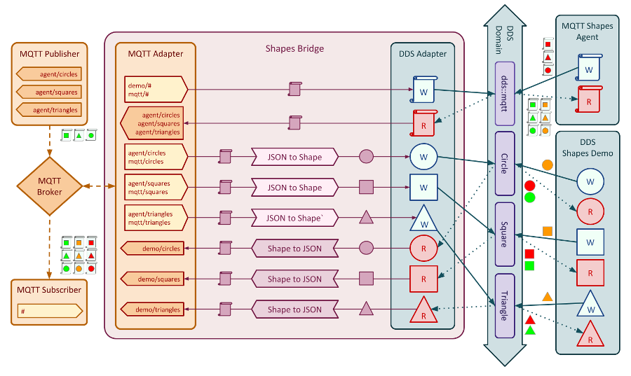
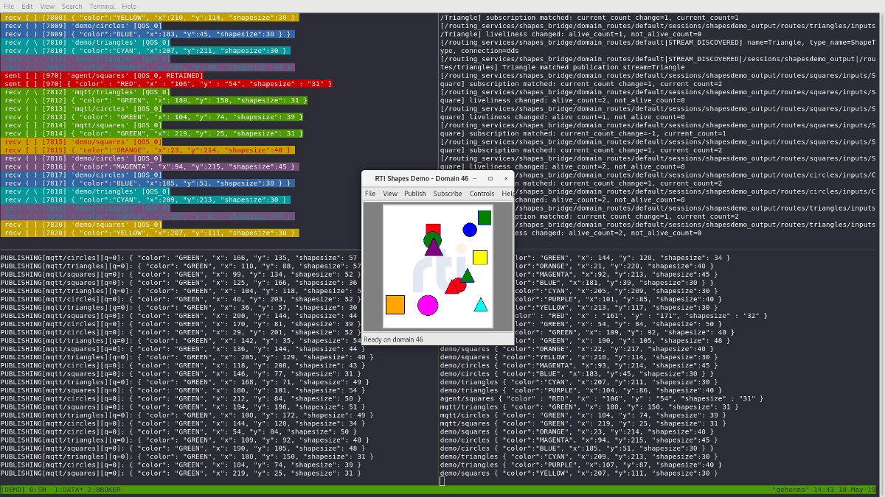
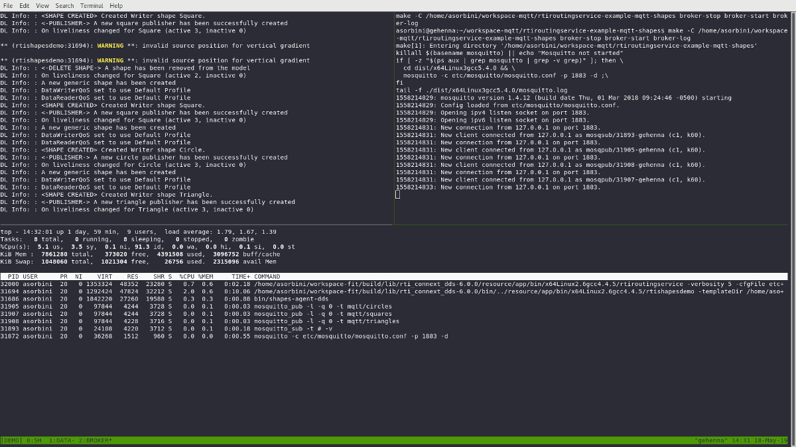

# Mqtt Shapes - An example integration of DDS and MQTT

This repository contains a example scenario which demonstrates how the DDS and
MQTT protocols can be integrated by a system to allow DDS applications to
access MQTT data, and viceversa.

Integration of the two protocols is achieved by deploying RTI Routing Service
with the MQTT adapter plugin, which allows it to establish client connections
to MQTT brokers, and to access MQTT data using a generic, typed, DDS
representation, which can encapsulate any opaque MQTT payload.

The scenario also demonstrates the use of custom transformations to translate
between the generic DDS representation of MQTT data, and "strongly typed" DDS
samples.

## Demo Scenario

The scenario presented by this example implements a simple "hybrid" system
where positional data of "shapes" (circles, triangles, squares) of different
size, is exchanged between applications connected to a DDS domain, and
applications connected to an MQTT broker.

Shapes are modelled in DDS by type `ShapeType`:

```idl
struct ShapeType
{
    string<128> color; //@key
    long x;
    long y;
    long shapesize;
};
```

The "type" of a shape is encoded by the DDS Topic name, thus the DDS domain
contains 3 topics for exchanging shapes, "Circle", "Square", and "Triangle".

MQTT applications use JSON to encode shape information, following the template:

```json
{
    "color": "COLOR",
    "x": 0,
    "y": 0,
    "shapesize": 0
}
```

The type of a shape is also encoded in the MQTT topic name, preceeded by a
prefix to identify the source application, for example "foo/circles",
"foo/squares", and "foo/circles".

When data is passed between MQTT and DDS, two "generic" DDS types,
`RTI::MQTT::Message`, and `RTI::MQTT::KeyedMessage` are used to encapsulate
the MQTT payload, and to encode the MQTT metadata (e.g. topic name and qos):

```idl
module RTI { module MQTT {

    /* An enum to model the "Quality of Service levels" offered by the MQTT
     * Protocol for publication and subscription of messages. */
    enum QosLevelKind {
        MQTT_QOS_UNKNOWN,
        MQTT_QOS_0,
        MQTT_QOS_1,
        MQTT_QOS_2
    };

    /* A data type to model the metadata associated with any MQTT message. */
    @nested
    struct MessageInfo {
        int32           id;
        QosLevelKind    qos_level;
        boolean         retained;
        boolean         duplicate;
    };

    /* A data type to model the payload of an MQTT message as an "opaque"
     * buffer of bytes. */
    @nested
    struct MessagePayload {
        sequence<octet>     data;
    };

    /* A data type to model the data and metadata associated with an MQTT
     * message. */
    struct Message {
        @optional string        topic;
        @optional MessageInfo   info;
        MessagePayload          payload;
    };

    /* A data type to model the data and metadata associated with an MQTT
     * message, with the MQTT topic used as key. */
    struct KeyedMessage {
        @key string             topic;
        @optional MessageInfo   info;
        MessagePayload          payload;
    };

}; // module MQTT
}; // module RTI
```

`RTI::MQTT::KeyedMessage` declares the MQTT topic name as key field, allowing
for multiple instances, each corresponding to a different MQTT topic,
within a single DDS topic.

The `sequence<octet>` member `payload.data` of both types is used to store
paylods of MQTT messages.

The following figure presents the overall architecture of the demo scenario,
including markers to describe data streams within the system:



The *MQTT Publisher* application publishes shapes as JSON strings to MQTT topics
`"mqtt/circles"`, `"mqtt/squares"`, and `"mqtt/triangles"`. These data are subscribed
to by an instance of the *MQTT Adapter* for RTI Routing Service, which
converts them to DDS samples and forwards them to the DDS applications.

The *MQTT Subscriber* application subscribes to all available MQTT topics, and
it receives JSON shapes published by the *MQTT Publisher*, and by the DDS
applications.

The instance of *RTI Shapes Demo* publishes and subscribes to DDS Topics using
type `ShapeType`.

The *Shapes Agent* applications subscribes and publishes data to DDS Topic
`"dds_mqtt"`, which uses type `RTI::MQTT::KeyedMessage` to encapsulate the
JSON-serialized shapes.

All application are able to receive data from all other applications in the
system:

- Shapes published by MQTT applications are "deserialized" from JSON into
    instances of `ShapeType` by custom transformations within RTI Routing
    Service.

- Shapes published by *RTI Shapes Demo* are propagated by RTI Routing
    Service to the rest of the system:

  - The samples are first converted, by a custom transformation for
    RTI Routing Service, into instances of `RTI::MQTT::Message` that
    contain a JSON serialization of the shape in their payload.

  - The MQTT Adapter for RTI Routing Service publishes the payload of
    each `RTI::MQTT::Message` is published to MQTT topics
    `"demo/circles"`, `"demo/squares"`, and `"demo/triangles"`,
    depending on the DDS Topic of origin.

  - Each MQTT message is delivered by the MQTT broker to the
    *MQTT Subscriber* application.

  - The MQTT broker also deliver each MQTT message back to the *MQTT
    Adapter*, which stores the payload in `RTI::MQTT::KeyedMessage`
    samples that are published to DDS Topic `"dds_mqtt"`, where they
    are picked up by the *Shapes Agent* application.

- Shapes published by *Shapes Agent* follow the inverse path of those
  published by *RTI Shapes Demo*:

  - The *MQTT Adapter* extracts the payload from the
    `RTI::MQTT::KeyedMessage` samples, and publishes them to MQTT topics
    `"agent/circles"`, `"agent/squares"`, and `"agent/triangles"`, based
    on the contents of each sample's key.

  - The MQTT Broker delivers all MQTT messages to *MQTT Subscriber*, and
    back to the *MQTT Adapter*.

  - A custom transformation parses `ShapeType` instances from the JSON
    payload, and the resulting samples are forward to *RTI Shapes Demo*
    via DDS Topics `"Circle"`, `"Square"`, and `"Triangle"`.

## Dependencies

The following additional external dependencies are required to run the demo:

- [Mosquitto MQTT Broker](https://mosquitto.org/download/)

- [tmux](https://github.com/tmux/tmux) (optional)

## Building

This section contains instructions on how to configure, build, and run the
demo on your system.

1. Follow instructions to clone and build the rticonnextdds-gateway
    repository. Make sure that the following components are built:

    - Adapter: MQTT
    - Processor: Forward Engine (By Input Value)
    - Transformation: JSON (Flat Type)
    - Transformation: Field (Primitive)
    - Example: MQTT Shapes

   If you plan on trying the "cloud" variant of the scenario, you must enable
   security features by specifying `RTIGATEWAY_ENABLE_SSL=ON` in your build.

2. Install the `mosquitto` MQTT Broker, and its companion, command-line
   client applications, `mosquitto_pub`, and `mosquitto_sub`. You can donwload
   these applications here: https://mosquitto.org/download/
   By default, the broker will be started and added to the services run
   at start up.

   On Linux systems:

    ```sh
    sudo apt install mosquitto mosquitto-clients
    # Stop broker and disable automatic execution
    sudo service mosquitto stop
    sudo service mosquitto disable
    ```

3. On Linux systems, optionally, you can also install `tmux` in order to spawn
   all components in a single window split into multiple panes:

    ```sh
    apt install tmux
    ```

## Running

All commands in this section assume that you already
[built and installed the demo](#building).

The directory where the repository's artefacts have been installed will be
referred to as `${INSTALL_DIR}`.

Configuration steps:

1. Enter directory `${INSTALL_DIR}/examples/mqtt/mqtt-shapes`.

    ```sh
    cd ${INSTALL_DIR}/examples/mqtt/mqtt-shapes
    ```

2. Configure required environment variables

    ```sh
    # Modify INSTALL_DIR if you installed the repository in a
    # custom location.
    export NDDSHOME=/path/to/rti_connext_dds \
           CONNEXTDDS_ARCH=myOsAndCompiler
    ```

    or

    ```bat
    # Modify INSTALL_DIR if you installed the repository in a
    # custom location.
    set NDDSHOME=/path/to/rti_connext_dds
    set CONNEXTDDS_ARCH=myOsAndCompiler
    ```

3. Restart the `mosquitto` MQTT Broker:

    ```sh
    sudo service mosquitto stop
    sudo service mosquitto disable
    mosquitto -c etc/mosquitto/mosquitto.conf -p 1883 -d
    ```
    > **NOTE**: the Windows version of `mosquitto` doesn't support the daemon
    > mode, so we shouldn't add the option `-d`.

4. (Optional) To monitor `mosquitto`'s log:

    ```sh
    tail -f mosquitto.log
    ```

The following commands can be run at once using `tmux` and the following
script, or `windows_run_all.bat`.
Note that `NDDSHOME` and `CONNEXTDDS_ARCH` should be set as explained above.
Also, make sure that `mosquitto_pub`, and `mosquitto_sub` are available from
the current command prompt, otherwise you should modify the PATH environment
variable.

Linux systems:

    ```sh
    ./scripts/tmux_session.sh
    ```

Windows systems:

    ```sh
    ./scripts/windows_run_all.bat
    ```

> **NOTE**: In order to close the Windows `windows_run_all.bat` script, all the
> windows which have been opened should be closed, including the RTI Shape Demo
> application.

You can run these commands manually in 5 different terminals. This README
assumes that `NDDSHOME` and `CONNEXTDDS_ARCH` environment variables are set
for all of the terminals. Also the working directory for them is
`${INSTALL_DIR}/examples/mqtt/mqtt-shapes`:

1. In a separate terminal, start the *MQTT Publisher* application:

    ```sh
    ./scripts/shapes_mqtt_publisher.sh GREEN
    ```

    > **NOTE**: The Linux script will publish `squares`, `circles` and
    > `triangles`. However, the Windows script will only publish `circles`.

2. In a separate terminal, start the *MQTT Subscriber* application:

    ```sh
    ./scripts/shapes_mqtt_subscriber.sh "#"
    ```

3. In a separate terminal, start the *Shapes Agent* application:

    ```sh
    LD_LIBRARY_PATH=$NDDSHOME/lib/$CONNEXTDDS_ARCH ./mqtt-shapes
    ```

4. In a separate terminal, start an *RTI Shapes Demo* instance:

    ```sh
    $NDDSHOME/bin/rtishapesdemo -compact -workspaceFile etc/shapes_demo_workspace.xml -dataType Shape -pubInterval 1000
    ```

5. In a separate terminal, start an *RTI Routing Service* instance:

    ```sh
        LD_LIBRARY_PATH=${INSTALL_DIR}/../../../lib:$NDDSHOME/lib/$CONNEXTDDS_ARCH \
        $NDDSHOME/bin/rtiroutingservice -cfgFile  etc/shapes_bridge.xml -cfgName shapes_bridge
    ```

> **NOTE**: The above commands are for Linux systems, there are similar `*.bat`
> scripts that can be used when using Windows. Also, we need to set the
> environment variables before running the corresponding command.

In order to see the shapes that are being published, you can subscribe to
different shapes by clicking in the following menu items in the
*RTI Shapes Demo* application:

- "Subscribe/Square..." and click 'OK' to use the default parameters.
- "Subscribe/Circle..." and click 'OK' to use the default parameters.
- "Subscribe/Triangle..." and click 'OK' to use the default parameters.

Additionally, you can create shapes publishers by clicking in the following
menu items in the *RTI Shapes Demo* application:

- "Publish/Square..." and click 'OK' to use the default parameters.
- "Publish/Circle..." and click 'OK' to use the default parameters.
- "Publish/Triangle..." and click 'OK' to use the default parameters.

> **NOTE**: The Windows `shapes_mqtt_publisher.bat` only publishes circles if
> the topic is not specified.

## Navigating the demo with tmux



After spawning the demo, you will be
presented with a `tmux` window containing 4 panels. In clockwise order,
from top right, each panel contains:

- An instance of *Shapes Agent*.
- An instane of RTI Routing Service with the MQTT Adapter and the custom
  Shapes/JSON transformation installed and enabled.
- An instance of *MQTT Subsscriber*.
- An instance of *MQTT Publisher*.

You can navigate between panels by using `Ctrl+b, <arrow key>`. The sequence
`Ctrl+b <arrow key>` (i.e. keep pressing `Ctrl+b` while pressing an arrow key)
will instead resize the currently panel in the direction of the pressed key.

A second window can be accessed using `Ctrl+b, 2`. This window contains
1 panel for running *RTI Shapes Demo*.



You can switch back to the previous windows using `Ctrl+b, 1`.

You can detach the `tmux` session and return to the terminal that started by
using `Ctrl+b, d`.

Once detached, you can resume the existing session using `tmux a -t DEMO`.

You can terminate the `tmux` session (and all processes spawned within) by
calling `tmux` directly as `tmux kill-ses -t DEMO`.
