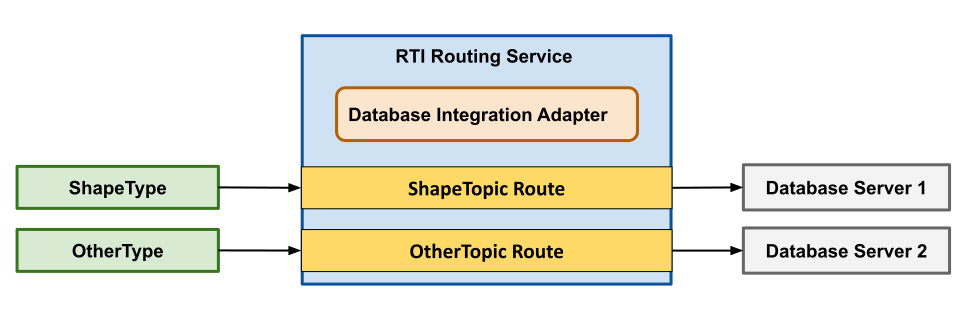

.. include:: vars.rst

.. _section-introduction:

************
Introduction
************

.. note::

    This software is provided for experimental purposes to evaluate 
    potential new features and gather customer feedback. These features 
    are not officially supported and must not be used in production 
    environments.

    For more information about experimental features in *Connext*, see 
    the `Connext What's New <https://community.rti.com/static/documentation/connext-dds/current/doc/manuals/connext_dds_professional/whats_new/index.html>`__.

|DIA| is a plugin for |RTI_RS| that enables 
storing DDS samples from specified *Topics* in relational databases. 

This plugin enables |RS| to:

* connect to database servers through Open Database Connectivity (ODBC)
* automatically create tables based on DDS *Topic* types, and 
* persist sample metadata, such as reception timestamps and instance handles

You can configure |RS| to route data from multiple |DDS_DOMAINS| to different
database servers, enabling applications to store and query historical DDS data
using standard SQL.

|DIA| uses the ODBC standard to connect to database
servers, enabling compatibility with any database that provides an ODBC driver.

    DDS/Database Integrated System Architecture

Key |DIA_HEADING| Features
==========================

* **Automatic Table Creation**:  automatically creates database tables based on
  DDS topic types, including metadata columns for timestamps and instance tracking.

* **Flexible Data Formatting**: Store DDS samples in JSON format for easy querying
  and integration with other applications.

* **Instance History Management**: Configure how many samples per instance to keep
  in the database.

* **Native MariaDB and PostgreSQL Support**: Out-of-the-box support for MariaDB and
  PostgreSQL databases with fully tested implementations. Support for other
  ODBC-compliant databases requires custom implementation
  (see the :ref:`section-database-support` chapter).

Examples
========

For a complete working example and detailed walkthrough, see the :ref:`section-tutorial`.