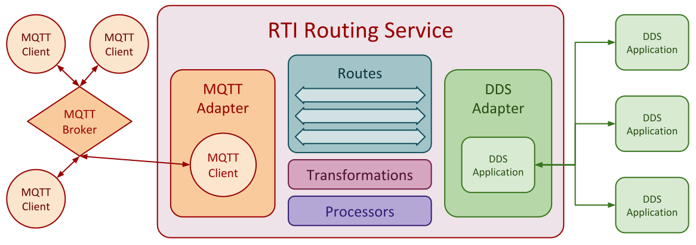

.. include:: vars.rst

.. _section-introduction:

************
Introduction
************

|RSMQTT| is a plugin for |RTI_RS_TM| which enables communication between
*MQTT* and *DDS* applications.

Using |RSMQTT|, |RS| can act as an |MQTT_CLIENT|, connect to an
|MQTT_BROKER|, publish |MQTT_MESSAGES|, and subscribe to |MQTT_TOPICS|
published by other *MQTT* applications.

Users can configure |RS| to route data between multiple |DDS_DOMAINS| and
|MQTT_BROKERS|, enabling all |PARTICIPANTS| in a |DDS_DOMAIN| to
exchange data with all |MQTT_CLIENTS| connected to an |MQTT_BROKER|, as
shown in figure :numref:`FigureSystemArchitecture`.

    DDS/MQTT Integrated System Architecture

|RSMQTT| performs automatic convertions between |MQTT_MESSAGES| and
|DDS_SAMPLES| of two "generic" |DDS_TYPES|, which model the metadata
(e.g. topic, qos, retained flag, etc.), and the opaque payload of
an |MQTT_MESSAGE|.

*DDS* applications can use these types to exchange data with *MQTT*
applications. Optionally, |RS|'s |TRANSFORMATION_API| can be used to implement
custom transformations between the *MQTT* payload, and |DDS_TYPES| used by
the system.

|RS|'s |PROCESSOR_API| can also be used to implement custom mappings between
*DDS* and *MQTT* data streams, for example, to automatically map different
|MQTT_TOPICS| into *Instances* of the same |DDS_TOPIC|.

