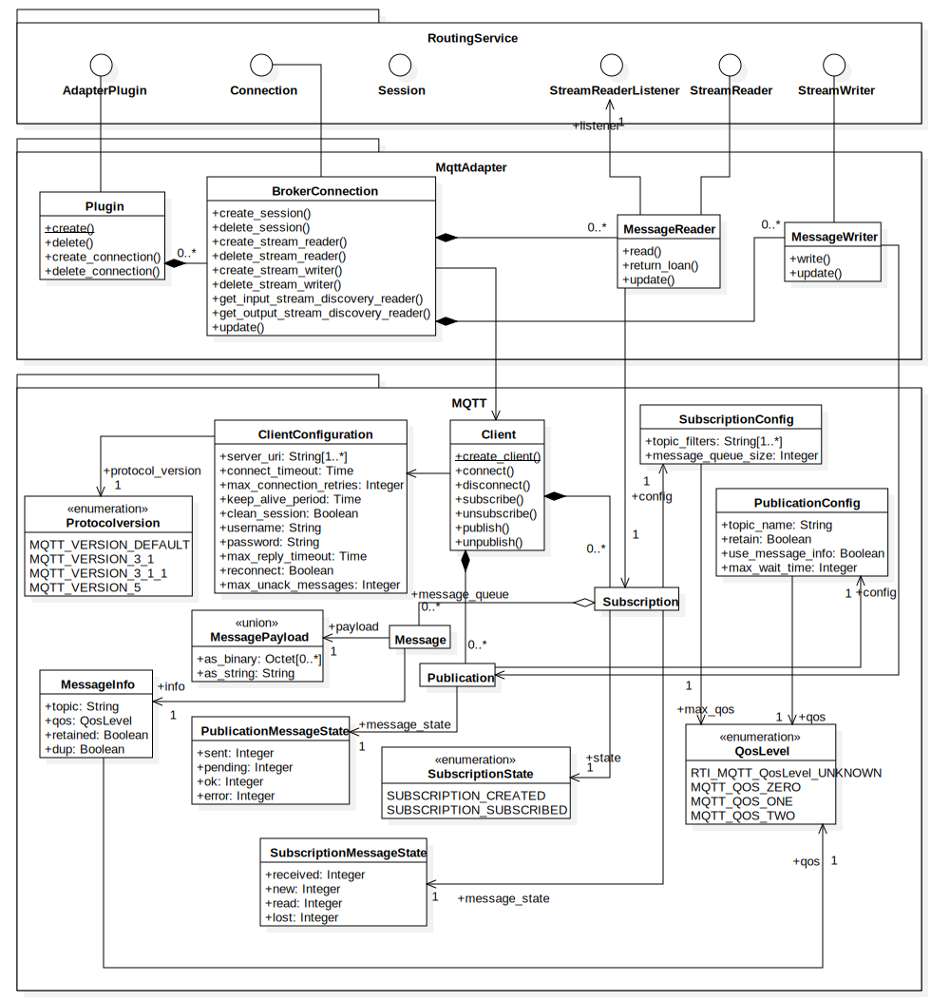

.. _section-modules:

MQTT Adapter API
****************

    MQTT Adapter UML Diagram

.. doxygengroup:: RtiMqtt_API
   :members:

.. _section-modules-compiler:

Compiler Defines
================

.. doxygengroup:: RtiMqtt_Compiler
   :members:

.. _section-modules-compiler-user:

User Defines
------------

.. doxygengroup:: RtiMqtt_Compiler_User
   :members:

.. _section-modules-compiler-auto:

Automatic Defines
-----------------

.. doxygengroup:: RtiMqtt_Compiler_Auto
   :members:

.. _section-modules-compiler-platform:

Platform Defines
----------------

.. doxygengroup:: RtiMqtt_Compiler_Platform
   :members:

.. _section-modules-compiler-client:

MQTT Library Defines
--------------------

.. doxygengroup:: RtiMqtt_Client_Library
   :members:

.. _section-modules-client:

MQTT Client API
===============

.. doxygengroup:: RtiMqtt_Client
   :members:

.. _section-modules-client-config:

MQTT Configuration
------------------

.. doxygengroup:: RtiMqtt_Client_Configuration
   :members:

.. _section-modules-client-config-client:

MQTT Client Configuration
^^^^^^^^^^^^^^^^^^^^^^^^^

.. doxygengroup:: RtiMqtt_Client_Configuration_Client
   :members:

.. _section-modules-client-config-sub:

MQTT Subscription Configuration
^^^^^^^^^^^^^^^^^^^^^^^^^^^^^^^

.. doxygengroup:: RtiMqtt_Client_Configuration_Subscription
   :members:

.. _section-modules-client-config-pub:

MQTT Publication Configuration
^^^^^^^^^^^^^^^^^^^^^^^^^^^^^^

.. doxygengroup:: RtiMqtt_Client_Configuration_Publication
   :members:

.. _section-modules-client-config-infr:

Configuration Infrastructure
^^^^^^^^^^^^^^^^^^^^^^^^^^^^

.. doxygengroup:: RtiMqtt_Client_Configuration_Infrastructure
   :members:

.. _section-modules-client-client:

MQTT Client
-----------

.. doxygengroup:: RtiMqtt_Client_Client
   :members:

.. _section-modules-client-sub:

MQTT Subscription
-----------------

.. doxygengroup:: RtiMqtt_Client_Subscription
   :members:

.. _section-modules-client-pub:

MQTT Publication
----------------

.. doxygengroup:: RtiMqtt_Client_Publication
   :members:

.. _section-modules-client-message:

MQTT Message
------------

.. doxygengroup:: RtiMqtt_Client_Message
   :members:

.. _section-modules-client-platform:

Platform Support
----------------

.. doxygengroup:: RtiMqtt_Client_Platform
   :members:

.. _section-modules-client-idl:

IDL Types
---------

.. doxygengroup:: RtiMqtt_Client_IDL
   :members:

.. _section-modules-client-idl-config:

MQTT Configuration
^^^^^^^^^^^^^^^^^^

.. doxygengroup:: RtiMqtt_Client_IDL_Config
   :members:

.. _section-modules-client-idl-message:

MQTT Message
^^^^^^^^^^^^

.. doxygengroup:: RtiMqtt_Client_IDL_Message
   :members:

.. _section-modules-client-idl-client:

MQTT Client
^^^^^^^^^^^

.. doxygengroup:: RtiMqtt_Client_IDL_Client
   :members:

.. _section-modules-client-idl-sub:

MQTT Subscription
^^^^^^^^^^^^^^^^^

.. doxygengroup:: RtiMqtt_Client_IDL_Subscription
   :members:

.. _section-modules-client-idl-pub:

MQTT Publication
^^^^^^^^^^^^^^^^

.. doxygengroup:: RtiMqtt_Client_IDL_Publication
   :members:

.. _section-modules-adapter:

RTI Routing Service Adapter Plugin
==================================

.. doxygengroup:: RtiMqtt_Adapter
   :members:

.. _section-modules-properties:

Configuration Properties
========================

.. doxygengroup:: RtiMqtt_Properties
   :members:

.. _section-modules-properties-client:

MQTT Client Configuration
-------------------------

.. doxygengroup:: RtiMqtt_Properties_Client
   :members:

.. _section-modules-properties-sub:

MQTT Subscription Configuration
-------------------------------

.. doxygengroup:: RtiMqtt_Properties_Subscription
   :members:
   
.. _section-modules-properties-pub:

MQTT Publication Configuration
------------------------------

.. doxygengroup:: RtiMqtt_Properties_Publication
   :members:
