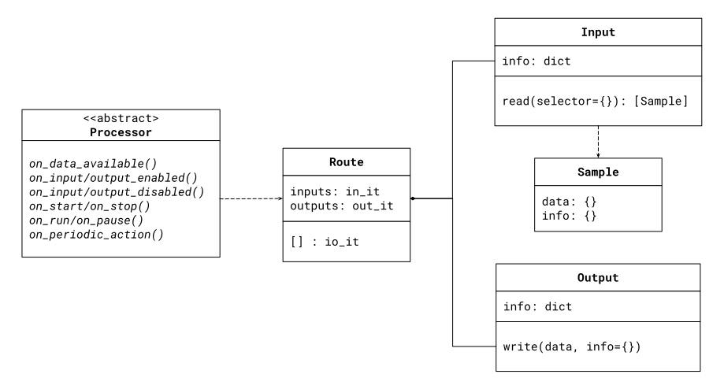

.. include:: vars.rst

.. _section-configuration:

*************
Configuration
*************

This section describes how to configure |RSPYTHON|.

All configuration is specified in |RS|'s XML configuration file.

.. _section-how-to-load-plugin:

Load the |PYTHON_PROCESSOR_NAME_PLAIN| Plugin
=============================================

In order to provide your Python Processor implementation, you will need to
load the binding plug-in as any other C/C++ plug-in Processor. That is, you
will need to register the plug-in in XML as follows:

.. code-block:: xml

    <plugin_library name="PythonPluginLib">
        <processor_plugin name="PyProcessor">
            <dll>rtipyprocessor</dll>
            <create_function>
                PyProcessorPlugin_create_processor_plugin
            </create_function>
            <property>
                <!-- list of configuration properties for this plug-in (See below) -->
            </property>
        </processor_plugin>
    </plugin_library>

.. warning:: |RS| must be able to find the |RSPYTHON| dynamic library
             (|PYTHON_ADAPTER_LIB_NAME_LINUX| on Linux® systems,
             |PYTHON_ADAPTER_LIB_NAME_MAC| on macOS® systems,
             or |PYTHON_ADAPTER_LIB_NAME_WIN| on Windows® systems). Make
             sure to include the library's directory in the library search
             path environment variable appropriate for your system
             (``LD_LIBRARY_PATH`` on Linux systems, ``RTI_LD_LIBRARY_PATH`` on
             macOS systems, or ``PATH`` on Windows systems, etc.).

Then, you can refer to this plug-in from the |ROUTE| where you want to install
the |PYTHON_PROCESSOR|:

.. code-block:: xml

    <processor plugin_name="PythonPluginLib::PyProcessor">
        <property>
            <!-- List of configuration properties that you can pass to your
                 Processor implementation
            -->
        </property>
    </processor>

Configure the |PYTHON_PROCESSOR_NAME_PLAIN| Plugin
==================================================

The binding plug-in requires information about how to load your
|PYTHON_PROCESSOR| implementation. This information is provided through the
plugin configuration properties. The complete set of properties is shown in
table below.

.. list-table:: Plugin Configuration Properties
    :name: TablePluginProperties
    :widths: 30 10 10 50
    :header-rows: 1

    * - Name
      - Required
      - Value
      - Description
    * - |CONF_CREATE_FUNCTION|
      - YES
      - ``<string>``
      - Name of function that instantiates the Processor.
    * - |CONF_MODULE_NAME|
      - YES
      - ``<string>``
      - Name of the Python module (file) that contains the code of your
        Processor implementation.
    * - |CONF_MODULE_PATH|
      - NO
      - ``<string>``
      - Absolute or relative path to where the module file is located. |br|
        Default: **.** (working directory).
    * - |CONF_MODULE_AUTORELOAD|
      - NO
      - ``<boolean>``
      - Specifies whether the module that contains the Processor implementation
        is reloaded on each occurrence of an event dispatch. Note that that
        reloading a module will affect only to the methods on the Processor
        but not state of the Processor object already created. That is, new
        method code can be executed but on the existing Processor instance.

Creating your Processor
=======================

To make your |PYTHON_PROCESSOR| pluggable, you will need to define a class
that inherits from ``proc.Processor``. This is an abstract class that defines
an abstract method for each one of the possible event notifications from the
Route.

For example:

.. code-block:: Python

    import proc

    class MyProcessor(proc.Processor):
        def on_data_available(self, route):
            ...

API Overview
============

The |RSPYTHON| component model is shown below.

The |PYTHON_API| model is based of two different of components:

- Classes: These are representations of |RS| entities that provide
  behavior usable by |PROCESSOR| implementations. There are five classes:

    - ``Processor``: The plug-in implementation. This is an abstract class from
      which implementations inherit from to customize the behavior of |ROUTES|.
      Note that all the callbacks are optional, so you can implement those you
      need.
    - ``Route``: This class represent instances of the |ROUTES|, which provide
      access to the inputs and outputs within.
    - ``Input``: Representation of a *Route* input from which you can read data.
    - ``Output``: Representation of a *Route* output to which you can write data.
    - ``Sample``: Representation of the information returned by a read operation
      on an input.

- Dictionaries: These are representation of pure data structures, containing
  as member names as keys and member values as values:

   - ``Input`` and ``Output`` description properties (name, stream and type
     names, etc).
   - ``Sample``'s data and information elements
   - ``Selector`` objects used to read subsets of data from the `Input`

A ``Processor`` implementation can perform operations on any of the other
components as needed. The user provides an implementation of a ``Processor``
whereas the other objects are constructed and provided by |RS| during
the execution of the ``Processor``

API Documentation
-----------------

Documentation for all the components of the |RS_PROCESSOR_API| is embedded in
the definition of the types in the `proc` module and also part of this
page in :ref:`section-api-reference`.

