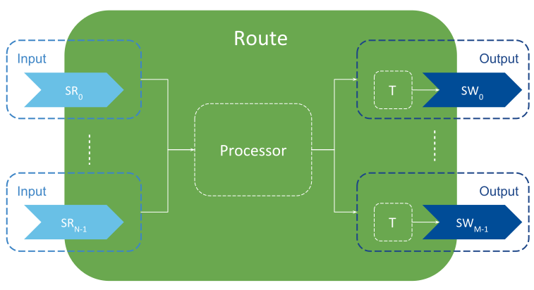

.. include:: vars.rst

.. _section-introduction:

Introduction
============

|RSPYTHON_TM| is a plugin for |RTI_RS| that implements a Python binding for the
|RS_PROCESSOR_API| as a native (C/C++) plug-in that provides the conversions to
and from Python.

|RS_PROCESSOR| is a pluggable-component that allows controlling the
forwarding process that occurs within |ROUTES|. The |RS_SDK| offers a set of
APIs that you can implement to customize the |ROUTE| behavior. See `Chapter SDK
in Routing Service User's Manual
<https://community.rti.com/static/documentation/connext-dds/6.1.0/doc/manuals/connext_dds_professional/services/routing_service/sdk.html>`_
for a list of officially supported languages.

This plug-in provides an implementation of a |PROCESSOR| (to provide an user-level
Python binding. The plug-in relies on the native interface of Python (known
as `ctype`).

The general model of a |PROCESSOR| is shown in figure below.

A |PROCESSOR| represents a multiple-input, multiple-output component attached
to a |ROUTE|, which dispatches events to the |PROCESSOR|. A |PROCESSOR| can
access the N inputs and M outputs of the owner |ROUTE|. Upon event
notification, the |PROCESSOR| can read data from any input, perform any
manipulation on the data, and write it on any of the outputs.

An example snippet is shown below. The example code is reading data from two
inputs, merging the data together to write a single output sample.

.. code-block:: python

    def on_data_available(self, route):
        samples_first = route.inputs[0].read()
        for first in samples:
            # read from the second input, the same instance of the sample to merge
            samples_second = route.inputs[1].read(dict(instance=first.info['instance_handle']))

            output_data = {
                'id':first.data['id'],
                'config':first['config'],
                'periodic':samples_second[0]['latency']
            }

            route.outputs[0].write(output_data)
